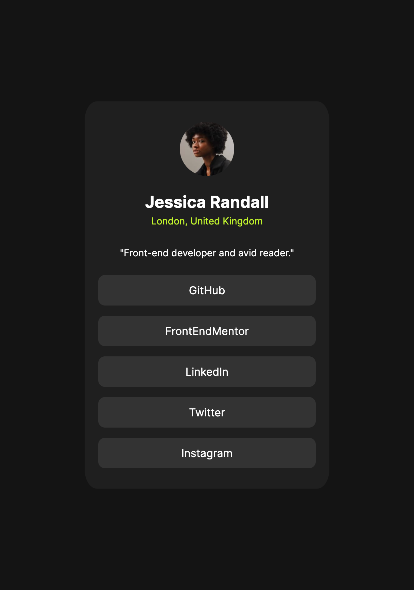

## Overview

### Screenshot

### Built with

- Semantic HTML5
- CSS custom properties
- Flex-box
- BME conventions for naming css classes
- css variables

### What I learned
How to better structure my html and css with the BME method

### Continued development

Continue developing the skills to build good fondamental structures.
As projects get larger I believe its of vital importance.

